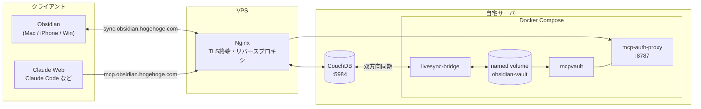

# 導入(という名の無駄話)
[Obsidian Self-Hosted LiveSyncの構築](https://zenn.dev/hyouhyan/articles/178652c594fe17)を書いてから1年ちょっと。
あの頃は「複数端末で同期できれば十分」だった。

で、最近はAIに色々聞くようになったわけだが、そのたびにObsidianを開いてコピペしている自分に気づいた。
日記もメモも研究のログも全部そこにあるのに。

「先週何やってたっけ」
「あの設定どうやったんだっけ」

この手の質問に、自分のVaultを読んだ上で答えてほしい。
そこでMCP (Model Context Protocol) である。

今回作るのは、Obsidian本体を一切起動せずにサーバー上でVaultの実体を持ち、MCPサーバーとして公開する構成。

# 作るもの
こんな感じ。



Obsidianの同期もMCPも、入口は同じVPSのNginx。
サブドメインで行き先を振り分けている。

登場人物が多いので、先に紹介しておく。

## Self-Hosted LiveSync / CouchDB
既存の資産。前回の記事で立てたやつ。
Obsidianの各端末はここを見て同期している。

## livesync-bridge
[GitHub - vrtmrz/livesync-bridge](https://github.com/vrtmrz/livesync-bridge)

Self-Hosted LiveSyncと同じ作者のもの。
CouchDBのリモートVaultとファイルシステムを双方向に同期するDeno製のデーモンで、`filesystem-livesync` と `livesync-classroom` の統合版らしい。

こいつのおかげで、Obsidian本体を起動しなくてもサーバー上にVaultの実体が展開される。
しかも双方向なので、サーバー側でファイルを書き換えればObsidianにも降ってくる。

「ヘッドレスObsidian」みたいな説明をされることがあるらしいが、実態はCouchDB ↔ ファイルシステムのレプリケーターである。
Obsidianの機能を再現するものではない。

## mcpvault
[GitHub - bitbonsai/mcpvault](https://github.com/bitbonsai/mcpvault)

Obsidian Vaultを読み書きするMCPサーバー。
Obsidian本体が不要でnpxで動くし、メンテナも活発。

`read_note` / `search_notes` / `list_directory` などの読み取り系に加えて、`write_note` / `patch_note` / `delete_note` の書き込み系も持っている。

ただしstdioしか喋れない。
MCPサーバーはstdio実装が主流らしく、HTTPで公開したければ別途ラップする必要がある。

## mcp-auth-proxy
[GitHub - sigbit/mcp-auth-proxy](https://github.com/sigbit/mcp-auth-proxy)

stdio→HTTP変換とOAuth 2.1認証をまとめて引き受けてくれるGo製のプロキシ。

なぜOAuthかというと、Claude Web版がBearerトークン認証に対応しておらず、OAuthしか受け付けないからである。
最初は `mcp-proxy` で素直にHTTP化していたが、ここで行き止まって乗り換えた。

パスワード認証のほか、GoogleやGitHub、汎用OIDCにも対応している。
今回は一番手っ取り早いパスワード認証でいく。

# サーバーサイドの構築
## ディレクトリを掘る
```zsh
mkdir -p ~/Docker/obsidian-mcp/{dat,data}
cd ~/Docker/obsidian-mcp
```

- `dat/` … livesync-bridgeの設定ファイル置き場
- `data/` … mcp-auth-proxyのOAuth鍵・状態の置き場

Vaultの実体はnamed volumeに持たせるので、ホスト側には掘らない。

## livesync-bridgeの設定
`dat/config.json` を作る。

```json:dat/config.json
{
  "peers": [
    {
      "type": "couchdb",
      "name": "remote",
      "group": "main",
      "url": "https://sync.obsidian.hogehoge.com",
      "database": "obsidian",
      "username": "admin",
      "password": "CouchDBのパスワード",
      "passphrase": "E2EEのパスフレーズ",
      "obfuscatePassphrase": "",
      "baseDir": "",
      "useRemoteTweaks": true
    },
    {
      "type": "storage",
      "name": "fs",
      "group": "main",
      "baseDir": "./data/",
      "scanOfflineChanges": true,
      "useChokidar": true
    }
  ]
}
```

同じ `group` を持つpeer同士が双方向に同期される。
今回はCouchDBとファイルシステムを `main` で繋いでいる。

この設定で大事なのは3つ。

### passphrase / obfuscatePassphrase
Obsidian側のプラグイン設定と完全に一致させる必要がある。

- `passphrase` … End-to-End Encryptionのパスフレーズ
- `obfuscatePassphrase` … Path Obfuscation(ファイル名の難読化)のパスフレーズ

:::message alert
Path Obfuscationを使っていないなら、`obfuscatePassphrase` は必ず空文字にすること。

ここを埋めてしまうと、bridgeだけがハッシュ化したドキュメントIDで書くことになり、CouchDBへの書き込みは成功するのにObsidianに一切反映されない。
しかも逆方向(Obsidian → bridge)は普通に動くので、片方向だけが黙って死ぬ。かなり気づきにくい。

自分の設定がどっちか分からなければ、CouchDBのWeb UI(Fauxton)で `_all_docs` を開けば一発で分かる。
ドキュメントIDが `f:` で始まるハッシュなら有効、ファイルパスがそのまま入っていれば無効。
:::

### baseDir
- couchdb側 … Vault全体を同期するなら空文字。特定フォルダだけなら `blog/` のように指定
- storage側 … `./data/` 配下にする

storage側の `baseDir` はコンテナ内のパスとして解釈される。
`./data/` 以外を指定するとvolumeの外に書き込まれ、コンテナを作り直した瞬間に消える。

### useRemoteTweaks
`true` にしておくと、chunkサイズやE2EEの設定をリモートDBから読んで勝手に合わせてくれる。
基本有効でいいと思う。

## compose.ymlを書く
```yaml:compose.yml
name: obsidian-mcp

services:
  # ── 初回だけ named volume の所有者を deno(1993) に揃える ──
  vault-init:
    image: alpine:3
    command: ["sh","-c","chown -R 1993:1993 /vault && echo init done"]
    volumes:
      - obsidian-vault:/vault

  # ── CouchDB ↔ ファイルシステム 双方向同期 ──
  livesync-bridge:
    build: https://github.com/vrtmrz/livesync-bridge.git
    image: localhost/livesync-bridge:latest
    volumes:
      - ./dat:/app/dat                       # config.json
      - obsidian-vault:/app/data             # ← baseDir は "./data/"
      - bridge-local-storage:/deno-dir/location_data
    depends_on:
      vault-init: { condition: service_completed_successfully }
    restart: unless-stopped
    logging: { driver: json-file, options: { max-size: "10m", max-file: "3" } }

  # ── MCPサーバー(OAuth付き) ──
  obsidian-mcp-server:
    image: ghcr.io/sigbit/mcp-auth-proxy:v2.10.2
    container_name: obsidian-mcp-auth-proxy
    ports:
      - "8787:8787"
    environment:
      EXTERNAL_URL: "https://mcp.obsidian.hogehoge.com"
      NO_AUTO_TLS: "true"
      LISTEN: ":8787"
      DATA_PATH: "/data"
      PASSWORD: "${MCP_PASSWORD:?set MCP_PASSWORD in .env}"
      TRUSTED_PROXIES: "リバースプロキシのIPアドレス"
      NPM_CONFIG_CACHE: "/npm-cache"
    command:
      - "--"                                 # ← これ以降が stdio MCP サーバの起動コマンド
      - npx
      - -y
      - "@bitbonsai/mcpvault@0.16.0"
      - /vault
    volumes:
      - ./data:/data
      - obsidian-vault:/vault
      - type: tmpfs                          # ← secrets を空で覆う
        target: /vault/secrets
        tmpfs:
          size: 4096
      - npm-cache:/npm-cache
    depends_on:
      vault-init: { condition: service_completed_successfully }
    restart: unless-stopped
    logging: { driver: json-file, options: { max-size: "10m", max-file: "3" } }

volumes:
  obsidian-vault:
  bridge-local-storage:
  npm-cache:
```

`.env` にパスワードを置く。
```zsh
echo 'MCP_PASSWORD=好きなパスワード' > .env
chmod 600 .env
```

以下、このcompose.ymlの勘所。

### vault-init は何をしているのか
livesync-bridgeのDockerfileは `VOLUME /app/data` を宣言しているだけで、ディレクトリ自体を作っていない。
なので空のnamed volumeをマウントすると `root:root 755` で作られる。

一方でコンテナはUID 1993 (`deno`) で動く。つまり書けない。

```
$ docker run --rm -v vol:/app/data --entrypoint sh livesync-bridge -c 'id; ls -ld /app/data; touch /app/data/x'
uid=1993(deno) gid=1993(deno)
drwxr-xr-x 2 root root 4096 /app/data
touch: cannot touch '/app/data/x': Permission denied
```

そこで初回だけ `chown` する使い捨てコンテナを挟んでいる。
`condition: service_completed_successfully` を使えばchownが終わってから本体が起動する。

### command の先頭の `--`
これが無いと `npx -y` の `-y` をmcp-auth-proxy自身のフラグとして食い、

```
panic: unknown shorthand flag: 'y' in -y
```

で再起動ループに陥る。
公式ドキュメントのCompose例はこれが抜けているのでご注意。

### NO_AUTO_TLS
mcp-auth-proxyはデフォルトでLet's Encryptから証明書を取りに行こうとする。
今回はVPSのNginxでTLSを終端するので、こいつ自身はHTTPで待ち受けさせる。

`LISTEN: ":8787"` とセットで、非rootでも起動できる形になる。

### ./data は消してはいけない
mcp-auth-proxyはここにHMACシークレットとJWT秘密鍵を保存している。
消すと再生成され、認可済みの全クライアントのOAuthトークンが無効になる。

`docker compose down -v` で消えるので、普段は `down` だけにしておこう。

### tmpfsでsecretsを隠す
named volumeの一部だけをマウントから外す、ということはDockerではできない。
代わりに空のtmpfsを上から被せて塗り潰す。

```yaml
      - obsidian-vault:/vault
      - type: tmpfs
        target: /vault/secrets
        tmpfs:
          size: 4096
```

これでMCP経由では `secrets/` の中身が見えなくなる。
実際にツールを叩いて確かめてみるとこうなる。

```
list_directory "/"        → {"dirs":["secrets","wiki",...],"files":[]}
read_note "secrets/pw.md" → Error: File not found
search_notes "TOPSECRET"  → []
```

ディレクトリ名だけは一覧に残るが、中身は一切取れない。
Vaultにパスワードやトークンを置いているなら必須。

### npm-cache
`npx -y ...` は毎回パッケージを取りに行くので、named volumeでキャッシュを残している。
ついでに `@0.16.0` とバージョンをピン留めしておく。`@latest` のままだと、ある日突然壊れる。

## 起動
```zsh
docker compose up -d
docker compose logs -f
```

初回はlivesync-bridgeのビルドとVault全体のスキャンが走るので、そこそこ待つ。
`[fs] <-- ... saved` がひたすら流れていれば同期されている。

# リバースプロキシの設定
CouchDBは前回の記事で `sync.obsidian.hogehoge.com` として公開済みなので、今回はMCP用に `mcp.obsidian.hogehoge.com` を追加する。

```nginx
server {
    listen 80;
    listen [::]:80;

    server_name mcp.obsidian.hogehoge.com;

    return 301 https://$host$request_uri;
}

server {
    listen 443 ssl;
    listen [::]:443 ssl;

    server_name mcp.obsidian.hogehoge.com;

    location / {
        proxy_pass http://MCPサーバーのIP:8787;

        proxy_http_version 1.1;
        proxy_buffering off;
        proxy_read_timeout 24h;
        proxy_set_header Connection "";

        include /etc/nginx/proxy_params;
    }

    ssl_certificate /etc/letsencrypt/live/mcp.obsidian.hogehoge.com/fullchain.pem;
    ssl_certificate_key /etc/letsencrypt/live/mcp.obsidian.hogehoge.com/privkey.pem;

    add_header  X-Robots-Tag "noindex, nofollow, nosnippet, noarchive";
}
```

地味に大事なのがSSE向けの設定。
MCPはServer-Sent Eventsで通信するので、`proxy_buffering off` と長めの `proxy_read_timeout` が要る。
これが無いとバッファリングされて応答が返ってこない。

# クライアント側の設定
## Claude Code
```zsh
claude mcp add --transport http obsidian https://mcp.obsidian.hogehoge.com/mcp
```

登録してClaude Codeを起動すると `Authorize` を求められる。
ブラウザが開くので、`.env` に設定したパスワードを入れれば認可完了。

## Claude Web
設定 → コネクタ → カスタムコネクタを追加、から同じURLを登録する。
こちらもブラウザ上で認可フローが走る。

試しに聞いてみよう。

> 今日の日記に何が書いてある?

自分のVaultを読んだ上で答えが返ってくれば成功。

# 書き込みをどう扱うか
ここまでで読み取りは完成した。
が、mcpvaultは `write_note` / `patch_note` / `delete_note` も持っている。

そしてlivesync-bridgeが双方向同期をしている以上、MCP経由で書き込めばObsidianにも反映される。
便利だが、同時になかなか怖い。

## 読み取り専用で始める
まずは読み取り専用で始めるのが安全。
mcpvaultには `--read-only` オプションがある。

```yaml
    command:
      - "--"
      - npx
      - -y
      - "@bitbonsai/mcpvault@0.16.0"
      - /vault
      - "--read-only"
```

これを付けると、mutating系のツールがツール一覧から消える。
クライアントから見れば存在しないことになるので、「書かないでね」とお願いするより遥かに確実。

## 解禁する場合
解禁するにしても、いきなり全開は避けたい。

自分はクライアント側の設定で、使えるツールをホワイトリストで指定している。

```yaml
  obsidian:
    url: https://mcp.obsidian.hogehoge.com
    auth: oauth
    tools:
      include:
        - read_note
        - search_notes
        - list_directory
        # ...(読み取り系)
        - write_note
        - patch_note
        # delete_note は意図的に含めない
```

`delete_note` を含めなければ、エージェントのツール一覧に一切現れない。
「削除して」と指示しても物理的に実行できないということ。

さらに、書き込み系のツールが呼ばれたら人間の承認を挟むようにしている。
書き込み先のパスとモード、そして実際に書き込まれる本文を表示して、OKを出すまで実行されない。

サーバー側(`--read-only`)とクライアント側(ホワイトリストと承認)の二段構えにしておけば、片方の設定をミスってもいきなり事故にはならない。

# おわりに
これで自分のObsidian VaultをAIの長期記憶として使えるようになった。

Obsidian本体を常時起動しておく必要がなく、CouchDBという既存の同期基盤にそのまま乗っかれるのがこの構成のいいところだと思う。

余談だが、livesync-bridgeでVaultの実体がファイルシステム上にあるということは、[Quartz](https://github.com/jackyzha0/quartz)のような静的サイトジェネレーターを同じvolumeに向けることもできる。
Vaultを書くだけで公開サイトが更新されるやつ。
実はもう試して動くところまで確認してあるので、そのうち別記事にしたい。

# 参考
- [GitHub - vrtmrz/livesync-bridge](https://github.com/vrtmrz/livesync-bridge)
- [GitHub - bitbonsai/mcpvault](https://github.com/bitbonsai/mcpvault)
- [GitHub - sigbit/mcp-auth-proxy](https://github.com/sigbit/mcp-auth-proxy)
- [Obsidian Self-Hosted LiveSyncの構築](https://zenn.dev/hyouhyan/articles/178652c594fe17)
